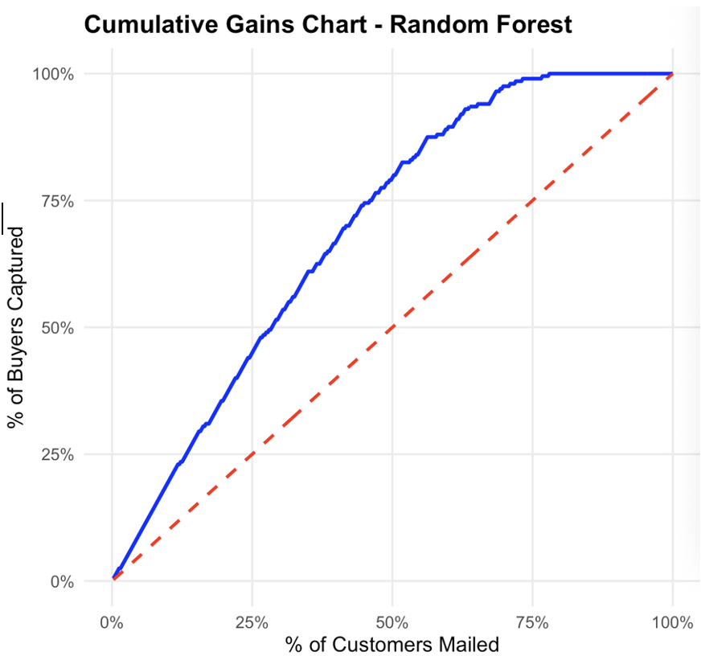
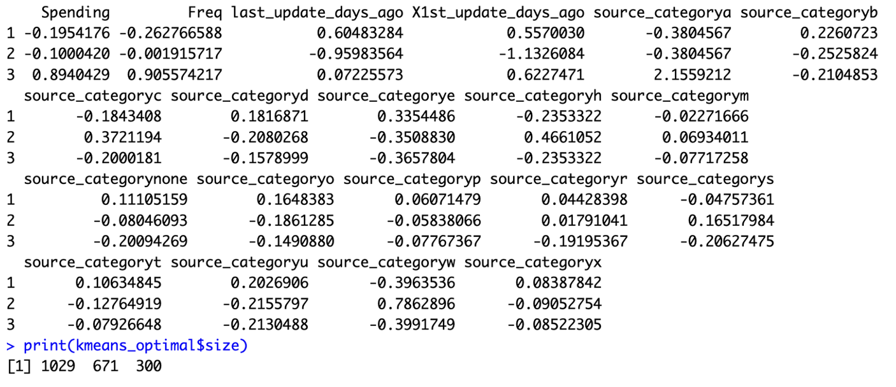

# ML_NORTH_POINT_SOFTWARE_MAILING_ANALYTICS
This project analyzes the mailing list of records from the software company that has 2000 records within it for the purposes of business goals in predicting customer purchase probability and segmenting customers based on their behavioral and transactional characteristics. 

# Introduction
North-Point is a software company that produces games and educational software, which has recently added to its offerings via a consortium of listing firms. In its efforts to maximize marketing potential, the firm is now planning to make an informed selection of the most predicted promising names from a pooled list that can be used in a new mail campaign. To support that effort, North-Point went ahead and completed a test mailing with a stratified random sample of 2000 customers (1000 purchasers, 1000 non-purchasers), in order to analyze and make assumptions regarding customer behavior and probabilities of making a purchase.

# Problem
North-Point has the challenge of determining which customers from the pooled consortium list of approximately 5,000,000 names are likely to respond to their new mailing campaign and purchase. They can only select 200,000 names from the pool. Mailing randomly raises several issues: 
 - **Wasted Resources**   Money is spent on printing postage and materials for people who aren't interested.
 - **Low Revenue**  Only a small percentage of random recipients will purchase, and have lost opportunities to maximize sales.
 - **Misuse of data**   They have access to a large amount of test data and pooled consortium data, but they are not fully using it to identify customers most likely to purchase.

## Business Goal
- Find a way to select customers from the pooled list who are most likely to make a purchase. 
- Identify and understand high-value customer segments within the software mailing list data.

## Analytical Goals
- **Analytical Goal 1**
  - Explore and preprocess the dataset to understand the customer characteristics and prepare it for predictive modeling.
  - Build a classification model to predict the probability that a customer will make a purchase.
  - Create the cumulative gains charts to show the number of purchasers captured by mailing top-ranked customers.

- **Analytical Goal 2**
  - Apply clustering algorithms to segment customers based on their behavioral and transactional characteristics.
  - Determine which group contains the highest proportion of high-value customers.
  - Analyze patterns in each group to understand their behavior and value.

# Ways to Address
- [x] Data Exploration
- [x] Data Preprocessing
- [x] Predictor Analysis and Relevancy
- [x] Data Dimension and Transformation
- [x] Data Partitioning
- [x] Model selection
- [x] Model Fitting, Validation Accuracy, and Test Accuracy
- [x] Model Evaluation
- [x] Recommendations

# Insights
- The majority of customers are US-based (82.45%), which is appropriate for a US-focused campaign and saves on international shipping expenses.
- Gender list is, overall, fairly balanced (52.45% Male, 47.55% Female), which demonstrates the broader appeal of the product.
- The majority of address types are business (77.90%) compared to residential (22.10%).
- Roughly 43% of customers have purchased products online, which means this is a sizable proportion of customers who could be comfortable purchasing online.
- The sources are highly unequal. This helps to understand which channels are most profitable.
    - **Top Tier Sources (>=10% of list)**
        - source_e (15.1%), source_w (13.75%), source_u (11.9%), source_a (12.65%)
    - **Mid-Tier Sources**
        - (~5% - 7% of list): source_r (6.85%), source_b (6%), source_c (5.6%), source_h (5.25%)
    - **Niche/Small Sources (<5% of list)**
        - source_s (4.7%), source_d (4.15%), source_o (3.35%), source_t (2.15%), source_x (1.80%), source_m (1.65%), source_p (0.6%)
### Freq
- The 3rd Quartile is 2.0. This means 75% of customers made 2 or fewer transactions over the past years.  
### last_update_days_ago
- The customer's last updated record varies from 1 day up to 4188 days (approximately 11.5 years) ago, indicating there is considerable variability in their engagement.
- Customers who have last updated their records more recently are more likely to respond to the mailing than those whose records are many years old may be less engaged.
### X1st_update_days_ago
- The earliest updates from customers date back from 1 day ago to roughly 11.5 years ago.
- Half of the customer records were first updated between 4.6 and 9.2 years ago.
### Spending
- Most customers (75%) spent $153 or less, showing that a small group of big spenders contributes a large share of total revenue.

## Missing
- No missing values.

## Empty Strings
- No empty strings were found in the dataset.

## Handling for Zero
- Zero values in Spending are valid because they represent customers who had a 0 spend and did not make a purchase, so no adjustments are needed.
- For Frequency, there are lots of zeros, which likely indicate either non-buyers or new customers.

## Duplicates
- Does not contain any duplicate sequence numbers.

## Handling Outliers
**Freq**
- High values in Freq indicate loyal or frequent buyers, which are essential to the success of any campaign.

**Spending**
- High values in Spending indicate high-value customers, which are an important target group in their own right for driving revenue.

**Conclusion**  
If these cases are eliminated, there is a risk of eliminating customers who are most important for targeting and predictive modeling. By retaining outliers, we allow predictive modeling and analysis to focus on the subscribers who are most likely to develop response rates and revenue.

## Outcome Variables
- Classification Outcome: **Purchase (1/0)**
- Clustering Outcome: **Clustering does not have a singular outcome variable. Instead, it forms groups based on patterns in variables.**

## Feature Engineering
### Creation of Source Category
- The 15 source variables (for example, source_a, source_b, ….) representing binary variables were aggregated into one categorical variable (i.e., source_category), allowing for
  16 levels: “a,” “b,” “c,” …; and “none” (where there was no active source).
- This conversion lowered the dimensionality of the data from 15 to 1, reducing the size and complexity of the dataset without sacrificing information.

## Handling Data Quality Issues
- A discrepancy was found in the dataset in which records stated no purchase (Purchase = 0) while at the same time having spent money (Spending = 1).
- This situation is logically contradictory because a customer who has spent money should be treated as a purchaser.

**Correction**
- These records were updated to reflect Purchase = 0 changes to 1.

## Feature Selection
- Most Important Predictors
  - Freq: (Accuracy, Gini | 100.14, 281.61)
  - source_category: (Accuracy, Gini | 65.21, 168.33)
  - last_update_days_ago: (Accuracy, Gini | 36.82, 124.57)
- Moderately Important Predictors
  - Address_is_res: (Accuracy, Gini | 26.04, 17.58)
  - Web.order: (Accuracy, Gini | 20.79, 37.22)
- Negligible or Negative Predictors
  - US: (Accuracy, Gini | 6.92, 9.002)
  - Gender.male: (Accuracy, Gini | -2.62, 10.18)
  - Do not contribute meaningfully to prediction, and it may introduce noise if included.

## Data Transformation 
 - Scaling Numerical Variables (KMeans)
 - One Hot Encoding for Categorical Variables

## Data Partitioning
Stratified Splitting
| Training Set | Validation Set | Test Set |
|----------|----------|----------|
| 60%  | 20%  | 20%  |

## Algorithm Selection
- Classification
    - Logistic Regression
    - Random Forest
- Clustering 
    - K-means Clustering with initial k
    - K-means Clustering with best k

## Classification Models Evaluation
| Model               | Dataset | Accuracy | Sensitivity | Specificity | Precision | F1-score |
|--------------------|--------|---------|------------|------------|-----------|----------|
| Logistic Regression | Test   | 0.795   | 0.875      | 0.715      | 0.754     | 0.81     |
| Random Forest       | Test   | 0.8075  | 0.875      | 0.74       | 0.771     | 0.82     |

- Overall, Random Forest is the better model for the business goal of selecting customers most likely to make a purchase.
  

- Hence, Random Forest is much better at identifying and ranking the buyers, and it helps to save on wasted marketing spending.
## K-Mean Clustering Evaluation

### Cluster Profiles and Sizes for K-Means (k = 3)

| Metric                          | k=2        | k=3        |
|---------------------------------|------------|------------|
| **Overall Mean Silhouette**      | 0.13166    | 0.15853    |
|                                 |            |            |
| **Cluster Distribution**         |            |            |
| Cluster 1 Size                   | 846 (42.3%)| 1029 (51%) |
| Cluster 2 Size                   | 1154 (57.7%)| 671 (34%) |
| Cluster 3 Size                   | -          | 300 (15%)  |
|                                 |            |            |
| **Cluster Quality (Silhouette Width)** |        |            |
| Segment 1 Quality                | 0.135      | 0.0672     |
| Segment 2 Quality                | 0.128      | 0.2002     |
| Segment 3 Quality                | -          | 0.3783     |
|                                 |            |            |
| **Statistical Distribution**     |            |            |
| Minimum                          | -0.03933   | -0.07097   |
| 1st Quartile                     | 0.06705    | 0.05689    |
| Median                           | 0.13334    | 0.11082    |
| 3rd Quartile                     | 0.1871     | 0.22289    |
| Maximum                          | 0.29655    | 0.51432    |

- k = 3 reflects three clear customer segments. Cluster 1 represents a large dormant/low-value majority, Cluster 2 represents a high-engagement middle group with growth potential,
  and Cluster 3 represents the top-value VIP segment.

# Recommendations
## Campaign Implementation
- Deploy the Random Forest models to select the top 200,000 customers most likely to purchase from the pooled list, ensuring higher campaign efficiency and return on investment.
- Implement tiered marketing strategies based on the 3-cluster segmentation:
  - **Premium Segment (15%)** – Cluster 3 is high-value, frequent buyers. Focus on retention and special offers.
  - **Medium Segment (34%)** – Cluster 2 is moderate-value, active customers who could become top customers with more engagement.
  - **Base Segment (51%)** – Cluster 1 is low-value, inactive customers who would need to be reactivated.

## Allocation of Resources
- Spend more on the premium customers (Cluster 3) who are buying.
- Spend less to save money on customers (Cluster 1) who are less likely to make a purchase.
